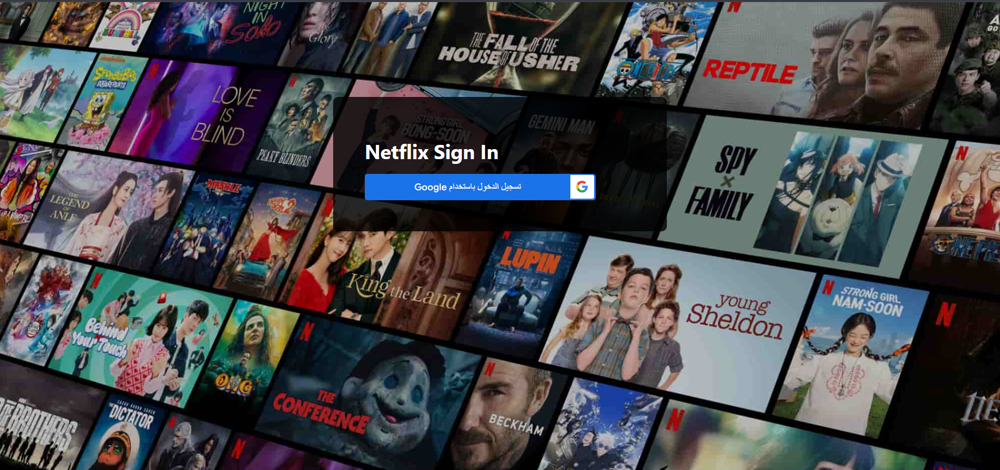
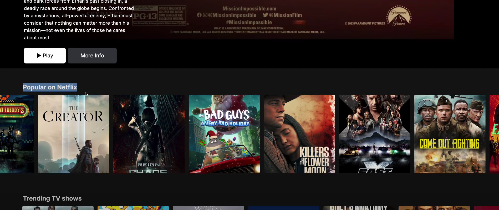
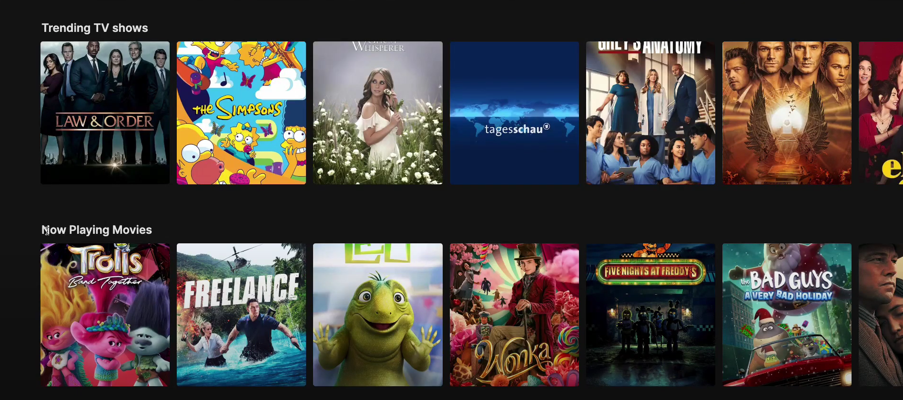

# Netflix Clone with Tailwind CSS

This project is a Netflix clone built using Angular and styled with Tailwind CSS. It replicates the look and feel of Netflix's user interface while providing a responsive and modern design.

## Features

- **Responsive Design**: Fully responsive layout using Tailwind CSS.
- **Dynamic Content**: Fetch and display movie and TV show data dynamically using The Movie Database (TMDb) API.
- **User Interface**: Clean and intuitive UI inspired by Netflix.
- **Authentication**: Google Sign-In integration for user authentication.
- **Angular Framework**: Built with Angular for a scalable and maintainable codebase.

## Installation

1. Clone the repository:
   ```bash
   git clone https://github.com/ammarnas/Netflix-Clone-With-Tailwind

   cd netflix-clone-with-tailwind:
2. Install dependencies:
   ```bash
   npm install
3. Start the development server:
      ```bash
    npm start
4. Open your browser and navigate to:
      ```bash
    npm start
## Technologies Used

- **Angular**: Frontend framework.
- **Tailwind CSS**: Utility-first CSS framework.
- **TypeScript**: Programming language for Angular.
- **HTML5 & SCSS**: Markup and styling.
- **Swiper.js**: For carousel functionality.
- **TMDb API**: For fetching movie and TV show data.

## Project Structure

The project follows a modular structure with the following key directories:

- **src/app/core**: Contains core components like the header and banner.
- **src/app/pages**: Contains page components like login and browse.
- **src/app/shared**: Contains shared services, models, pipes, and components.
- **src/assets**: Contains static assets like images.

## API Integration

This project uses the TMDb API to fetch movie and TV show data. Ensure you replace the API key in the MovieService with your own TMDb API key.

## Contributing

Contributions are welcome! Please fork the repository and submit a pull request.

## License

This project is licensed under the MIT License. See the LICENSE file for details.

## Screenshots

### Home Page
<p align="center">
  
</p>

### Popular Movies
<p align="center">
  
</p>

### Trending Movies
<p align="center">
  
</p>
